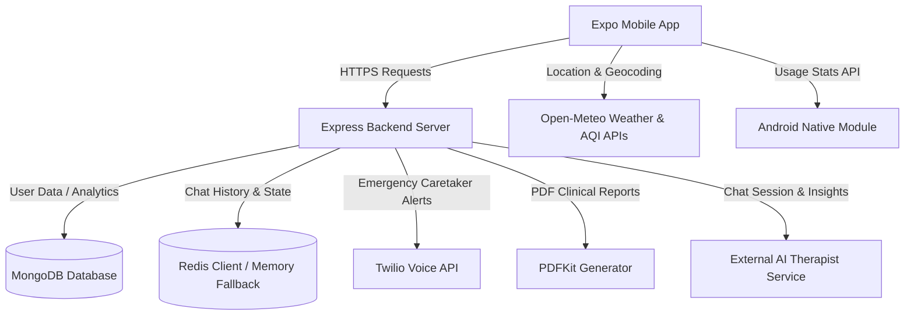

# 🧠 MindBuddy Sanctuary

Welcome to **MindBuddy Sanctuary**, a next-generation clinical behavior and mental well-being companion. MindBuddy is designed to bridge the gap between active self-reporting, passive environmental sensing, native device metrics, and proactive crisis management.

By combining an **Expo React Native mobile client** with a robust **Node.js/Express backend**, MindBuddy offers a comprehensive dashboard, interactive AI therapy, real-time weather & AQI tracking, automated caretaker alert calls, and clinically structured progress reports.

---

## 🌟 Key Features

### 1. 🔐 Secure User Authentication
* Full sign-up and login capabilities with password encryption via `bcryptjs`.
* State preservation and secure route protection using JSON Web Tokens (JWT) stored in mobile local storage (`AsyncStorage`).

### 2. 📱 Android Native Screen Time Tracker
* Utilizes a custom Android native Java module (`MindBuddyModule`) to interact directly with the OS's usage stats system, fetching exact daily foreground screen-time data.
* Graceful fallback mock system when running in Expo Go, iOS, or Web, keeping development fluid.

### 3. 🌦️ Environmental & AQI Telemetry
* Integrates location services (`expo-location`) to fetch real-time physical telemetry.
* Leverages open APIs (Open-Meteo) to obtain current temperature, relative humidity, and air quality index (AQI) values, linking external conditions to mental wellness trends.

### 4. 💬 AI Therapist Chat Companion
* Powered by a specialized external ML chatbot service, providing structured mental health conversations.
* Real-time history synchronization and dynamic evaluation of acute stress scores and risk levels.
* Session summary and stress tracking saved to user profiles upon ending a chat session.

### 5. 🚨 Immediate Crisis Detection & Twilio Alert Calls
* **Safety First**: Implements immediate keyword crisis detection (scanning for indicators of suicide, self-harm, or panic attacks) directly in the chat pipeline.
* **Proactive Carer Alerts**: Automatically triggers real-time voice calls to designated caretakers or emergency contacts using the **Twilio Voice API** if a crisis or high-risk stress score (>= 9/10) is detected.
* **Demo Sandbox**: Seamlessly falls back to simulated console logs when Twilio keys are not provided, making demoing easy.

### 6. 📄 Clinical Wellness Reports (PDF)
* Compiles clinical reports on demand using the backend's `pdfkit` module.
* Formats data into a structured grid highlighting mood states, sleep quality, daily screen limit boundaries, and clinical recommendations.
* Generates downloadable medical-grade PDF files for easy export and consultation.

---

## 🏗️ System Architecture



### Stack breakdown
* **Frontend**: React Native, Expo SDK 56, Expo Router (file-based routing), TypeScript, Axios, React Native Reanimated.
* **Backend**: Node.js, Express, MongoDB (Mongoose ODM), Redis (with automatic in-memory fallback), PDFKit, Twilio SDK, dotenv.

---

## 📂 Repository Structure

```text
code_yodhas_datathon/
├── backend/                  # Node.js/Express server logic
│   ├── config/               # DB and cache client connections (Redis)
│   ├── controllers/          # Business logic (auth, chat, dashboard, reports)
│   ├── middleware/           # JWT verification middlewares
│   ├── models/               # Mongoose schemas (User, Sleep, Stress, Mood, Activity)
│   ├── routes/               # Express API endpoints
│   ├── utils/                # Utility helpers (Twilio services, risk calculator)
│   ├── dummy.csv             # Ingestion template database file
│   ├── server.js             # API entrypoint
│   └── package.json
│
├── frontend/                 # Expo React Native application
│   ├── src/
│   │   ├── app/              # File-based router pages (login, index, chat, sleep, analytics)
│   │   ├── components/       # Shared UI components
│   │   ├── constants/        # Style guides, colors, assets configurations
│   │   ├── services/         # API hooks (axios client, weather fetching, native module hooks)
│   │   └── global.css        # Tailwind styling & visual tokens
│   ├── assets/               # Splash screens, icons, media resources
│   ├── app.json              # Expo configuration metadata
│   └── package.json
│
└── web-app-reference/        # Baseline web application files for cross-platform validation
```

---

## ⚙️ Configuration & Environment Setup

### 1. Backend Environment Variables
Create a file named `.env` in the `/backend` folder with the following structure:

```env
# Database Connections
MONGO_URI=mongodb://127.0.0.1:27017/mindbuddy    # MongoDB local/atlas connection URI
JWT_SECRET=your_super_secret_jwt_key             # Used for signing session keys

# Server Ports
PORT=5000

# Caching & Session Storage (Optional - fallback to memory is automatic)
REDIS_URL=redis://127.0.0.1:6379

# Twilio Emergency Alert Services (Optional - logs alerts to console if left blank)
TWILIO_ACCOUNT_SID=ACXXXXXXXXXXXXXXXXXXXXXXXXXXXXXXXX
TWILIO_AUTH_TOKEN=your_twilio_auth_token
TWILIO_PHONE_NUMBER=+1517XXXXXXX
CARETAKER_PHONE=+91XXXXXXXXXX                    # Default emergency phone number
```

### 2. Frontend Connection Base URL
Open `frontend/src/services/api.ts` and modify the `API_BASE_URL` to target your local machine's IP address:

```typescript
const API_BASE_URL = Platform.select({
  android: 'http://<YOUR_IP_ADDRESS>:5000/api',
  default: 'http://<YOUR_IP_ADDRESS>:5000/api',
});
```

---

## 🚀 Execution & Setup Guides

### Running the Backend Server
1. Navigate into the backend workspace:
   ```bash
   cd backend
   ```
2. Install npm dependencies:
   ```bash
   npm install
   ```
3. Run the development server:
   ```bash
   node server.js
   ```

### Running the Mobile Client
1. Navigate into the frontend workspace:
   ```bash
   cd ../frontend
   ```
2. Install npm dependencies:
   ```bash
   npm install
   ```
3. Boot up Expo developer tools:
   * To test in **Expo Go** or an emulator/web:
     ```bash
     npx expo start
     ```
   * To boot the project directly for **Android**:
     ```bash
     npm run android
     ```
   * To boot the project directly for **Web**:
     ```bash
     npm run web
     ```

---

## 🔒 Safety, Security & Compliance
* **Local Fallback Systems**: Designed to be resilient against missing cloud resources. If Redis isn't running, it triggers a warning and moves chat cache to RAM. If Twilio keys are missing, emergency calls are simulated in server logs.
* **Instant Stress Interceptor**: Suicide, self-harm, or panic-trigger words immediately halt chatbot standard queues, push risk levels to high (9/10), and dial emergency caretaker contacts instantly before completing LLM generation.
* **Confidentiality**: All clinical report generations are encrypted under token authorization middleware.